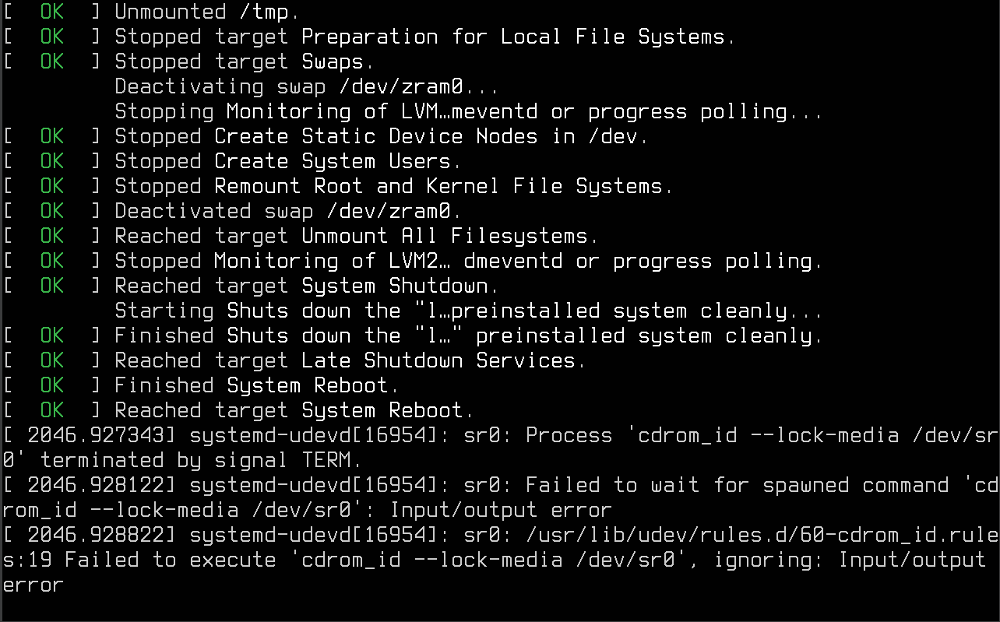

# Manual de Instalação: POP-OS
### Bem-vindo ao manual de instalação do POP-OS! Desenvolvido pela System76, o POP-OS é uma distribuição Linux baseada no Ubuntu, projetada para oferecer uma experiência intuitiva e eficiente para usuários de todos os níveis de habilidade. Com uma interface elegante, recursos poderosos e uma comunidade vibrante de usuários, o POP-OS é uma escolha popular para desktops e laptops.
### Este manual fornecerá instruções detalhadas para instalar o POP-OS em seu sistema, garantindo que você tenha uma transição suave para esta plataforma incrível. Seja você um usuário iniciante ou experiente, este guia irá orientá-lo passo a passo através do processo de instalação, permitindo que você aproveite ao máximo o poder e a flexibilidade do POP-OS.
## 1º Passo - Escolha do Idioma.
#### Selecione o idioma de sua preferência e clique em _Select_.

## 2º Passo - Verificação do Teclado.
#### Selecione seu tipo de teclado e clique em _Selecionar_.

## 3º Passo - Instalação.
#### Selecione se deseja ter uma versão "limpa" (sem arquivos anteriores) ou uma versão customizada e clique em _Next_. No atual exemplo, foi selecionado o _"Clean Install"_.

#### Selecione o arquivo de sua preferência e clique em _Apagar e Instalar_.

- ### Criação do Perfil.
#### Defina o seu nome e nome de usuário.

#### Clique no robô menor para alterar sua foto de perfil, selecione e clique em _Open_.

#### Defina a senha da conta e clique em _Next_.

#### Decida a Encriptação da Unidade.

#### Reinicie o dispositivo.

### 4º Passo - Carregamento e Reinicialização.

#### Aguarde o carregamento. Não desligue o computador.

#### Insira a sua senha, caso houver uma password de encriptação.

#### Selecione o usuário.

#### Acesse o usuário por meio da senha.

### 5º Passo - Customizar.
#### Aqui é o espaço de definições básicas do Layout. Selecione o que for de sua preferência e siga clicando em _Próximo_.

# Parabéns por concluir a instalação do POP-OS! 
### Com o POP-OS, você está no controle de um sistema operacional poderoso e flexível, pronto para atender às suas necessidades de produtividade, entretenimento e desenvolvimento. Continue explorando, experimentando e descobrindo tudo o que o POP-OS tem a oferecer. Obrigado por escolher o POP-OS e aproveite sua jornada no mundo do software livre e de código aberto!

